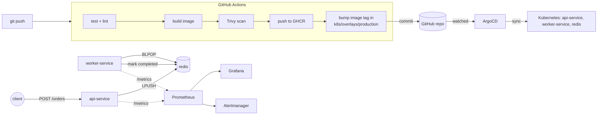

# Architecture

OrderFlow is deliberately a small application wrapped in a real platform. The
app (an order intake API backed by a queue worker) exists to give the
platform something to run — the point of this repo is everything around it.

## Components

| Layer | Tool | What it owns |
|---|---|---|
| App | Node.js / Express, Redis | `api-service` accepts orders and enqueues them; `worker-service` drains the queue and marks orders complete. Both expose `/healthz`, `/readyz`, `/metrics`. |
| CI | GitHub Actions (`.github/workflows/ci-cd.yml`) | Lint (hadolint, kubeconform), test, build, Trivy vulnerability scan, push to GHCR, then bump the image tag in `k8s/overlays/production`. |
| IaC | Terraform (`infra/terraform/`) | Provisions the local `kind` cluster and bootstraps cluster-wide platform tooling: ArgoCD and kube-prometheus-stack. Terraform never touches the app itself. |
| CD | ArgoCD | Watches `k8s/overlays/production` in this repo and continuously reconciles the cluster to match it (auto-sync + self-heal + prune). |
| Manifests | Kustomize (`k8s/`) | `base/` has the Deployments/Services/HPAs/ServiceMonitors/PrometheusRule; `overlays/staging` and `overlays/production` patch replica counts, NodePorts, and image tags per environment. |
| Observability | kube-prometheus-stack (Prometheus, Grafana, Alertmanager) | ServiceMonitors scrape `/metrics` from both services; a provisioned Grafana dashboard visualizes them; a PrometheusRule alerts on service-down, queue backlog, error rate, and slow processing. |

## Why this split

Terraform and ArgoCD have non-overlapping jobs on purpose:

- **Terraform** answers "does the cluster and its platform tooling exist?" — cluster
  lifecycle, ArgoCD, monitoring stack. Re-running `terraform apply` should never
  redeploy the app.
- **ArgoCD** answers "does the cluster match git?" for the application. CI's job
  is to produce a new image and tell git about it (by bumping the tag in
  `k8s/overlays/production/kustomization.yaml`); ArgoCD's job is to notice and
  apply it. Nobody runs `kubectl apply` by hand.

This is the standard GitOps split: CI does continuous integration and stops at
"update the manifest," CD (ArgoCD) does continuous deployment by watching git.

## Request / data flow

## Local-demo simplifications (called out deliberately)

- No Ingress controller — `api-service` is exposed via NodePort for
  simplicity. A real environment would front it with an Ingress/LoadBalancer
  and TLS.
- Prometheus/Grafana run without persistent volumes (`retention: 6h`) — fine
  for a demo cluster that gets torn down, not for production.
- ArgoCD is reached via `kubectl port-forward` rather than an exposed
  Ingress, and runs with `server.insecure=true` (plain HTTP behind the
  port-forward) purely to avoid self-signed TLS friction in a local demo.
- metrics-server runs with `--kubelet-insecure-tls` because `kind` nodes
  don't have kubelet serving certs metrics-server can verify by default.
  Standard for local `kind`/`minikube` clusters; not something you'd do
  against a real cluster.
- GHCR packages are set to public visibility so the cluster can pull images
  without an `imagePullSecret`. A private registry would need one configured
  on the `orderflow` namespace's default service account.
